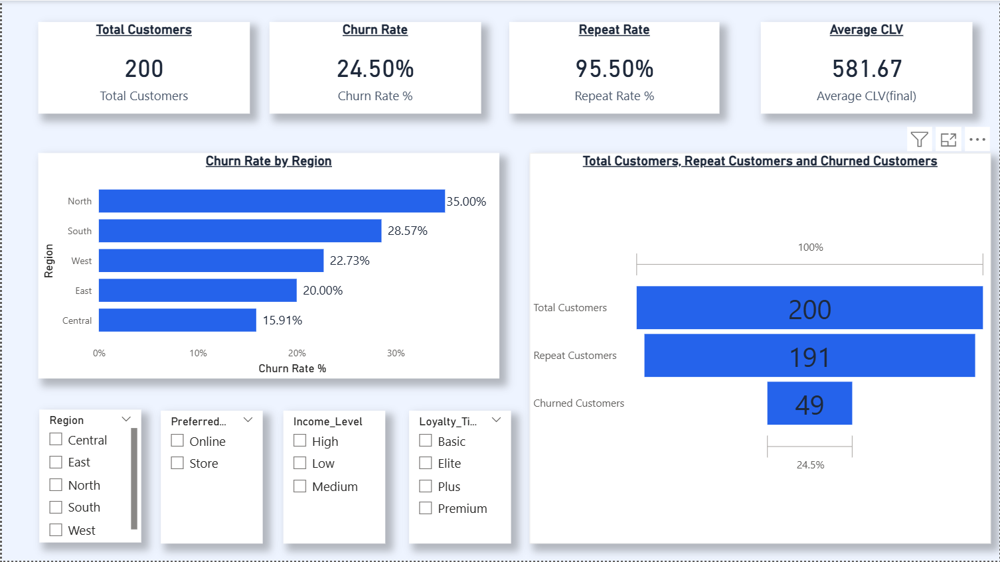
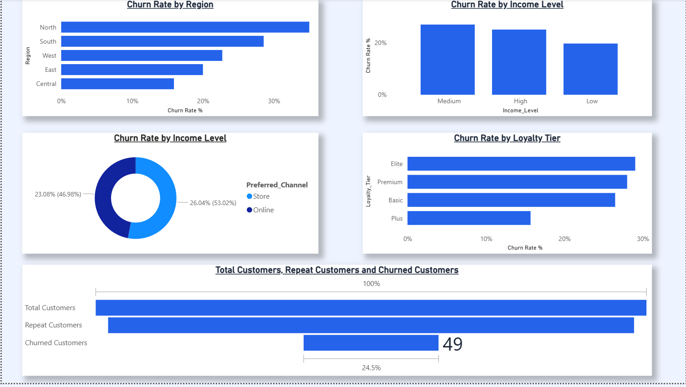
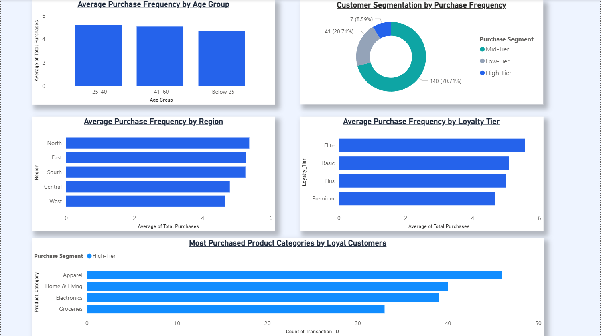
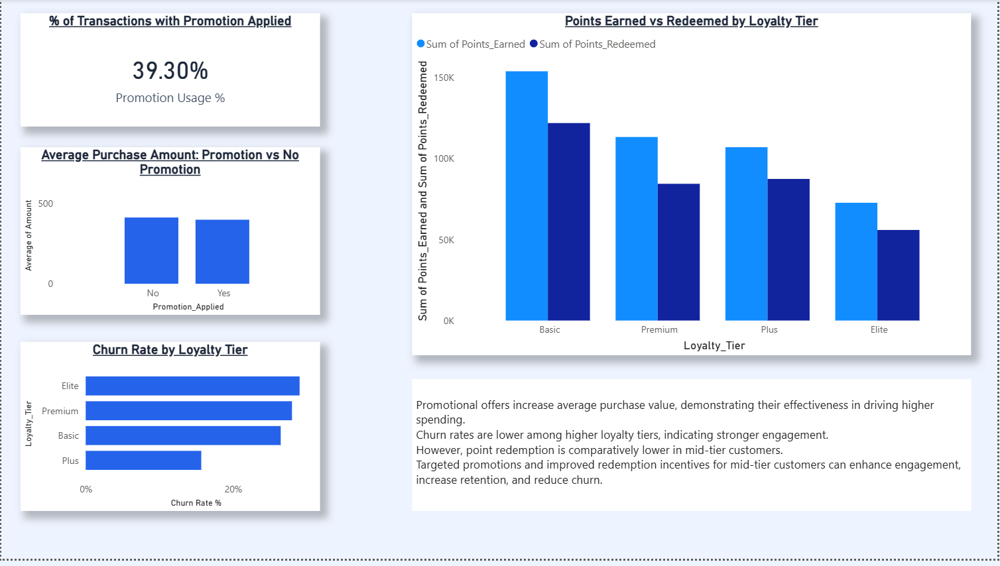
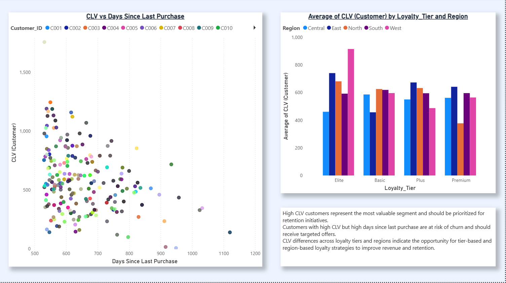

# Customer Retention Analysis Dashboard

This project analyzes customer behavior, churn risk, and loyalty program impact using Power BI.  
The goal is to identify patterns in customer transactions and develop strategies to improve customer retention.

---

## Tools Used

- Power BI
- Microsoft Excel
- SQL

---

## Dataset Files

The project uses the following datasets:

- Customer_Demographics.csv
- Customer_Transactions.csv
- Store_Locations.csv
- Loyalty_Program.csv
- Churn_Labelled_Customers.csv

---

## Key Metrics

- Total Customers: 200
- Churn Rate: 24.5%
- Repeat Rate: 95.5%
- Average Customer Lifetime Value (CLV): 581.67

---

## Dashboard Overview

### KPI Dashboard

---

### Churn Analysis

---

### Repeat Purchase Analysis

---

### Loyalty and Promotion Impact

---

### CLV and Customer Segmentation

---

## Key Insights

- Northern region shows the highest churn rate among customers.
- Higher loyalty tiers generally have lower churn rates.
- Promotions increase the average purchase amount.
- Customers with high CLV but long inactivity periods may be at risk of churn.

---

## Project Objective

To help businesses understand customer behavior and identify opportunities to improve customer retention and loyalty through data-driven insights.

